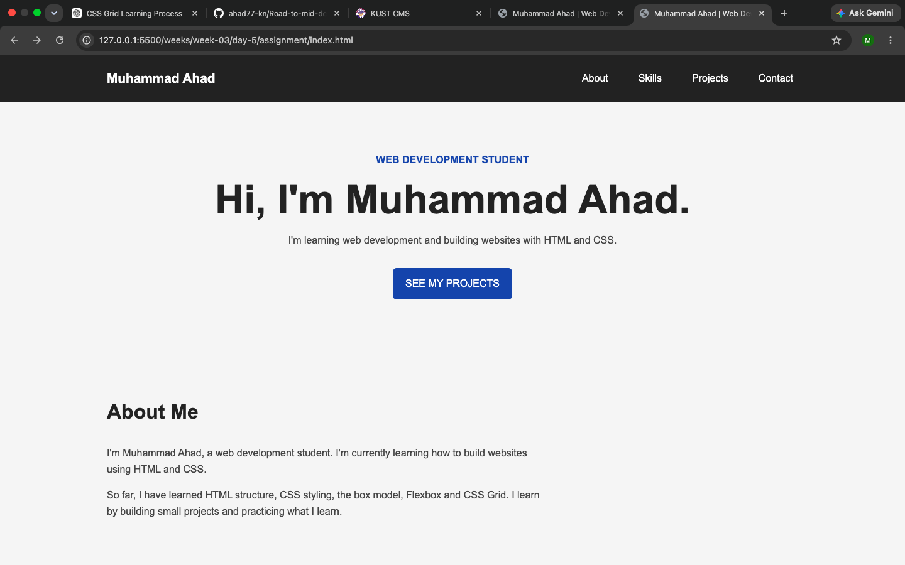

# Muhammad Ahad Portfolio

This is my Phase 1 portfolio website.

I built this portfolio while learning web development. It shows my skills and projects that I completed during Weeks 1–3.

## Sections

- Hero
- About
- Skills
- Projects
- Contact

## Technologies

- HTML
- CSS
- Flexbox
- CSS Grid

## Projects

- Pricing Card
- Flexbox Product Cards
- CSS Grid Layout
- Grid Image Gallery
- YouTube Homepage
- Responsive Card Gallery

## How to Run

Download or clone the project and open `index.html` in a web browser.

## Live Website

GitHub Pages:

https://github.com/ahad77-kn/Road-to-mid-dev/tree/main/weeks/week-03/day-5

## Screenshot

